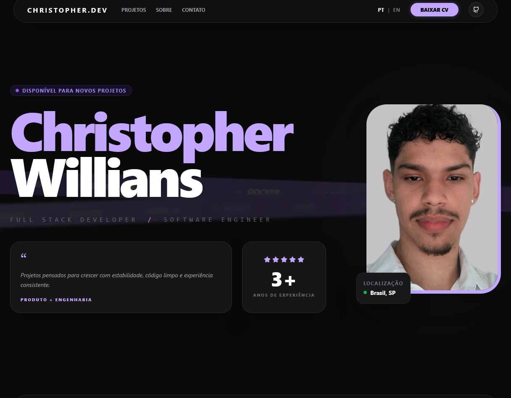

# Portfólio

Portfólio pessoal desenvolvido para apresentar minha trajetória como desenvolvedor, projetos, tecnologias e formas de contato.

O projeto foi desenvolvido do zero como uma evolução da primeira versão do meu portfólio, criada há quase 3 anos utilizando apenas HTML, CSS e JavaScript.

## 🚀 Tecnologias

- React
- TypeScript
- Vite
- CSS
- ESLint
- Git

## ✨ Funcionalidades

- 🌐 Suporte aos idiomas **Português e Inglês**
- 📱 Interface responsiva
- 🧩 Componentização com React
- 🔒 Tipagem estática com TypeScript
- 📂 Apresentação dos principais projetos
- 👨‍💻 Informações sobre minha trajetória e conhecimentos
- 📩 Seção de contato
- ⚡ Desenvolvimento e build utilizando Vite

## 📸 Preview

### Português



### English


## 🛠️ Instalação

Clone o repositório:

```bash
git clone https://github.com/christopherfifo/Portifolio.git
```

Acesse a pasta do projeto:

```bash
cd Portifolio
```

Instale as dependências:

```bash
npm install
```

Execute o projeto em ambiente de desenvolvimento:

```bash
npm run dev
```

O projeto estará disponível no endereço informado pelo Vite no terminal.

## 📦 Build

Para gerar a versão de produção:

```bash
npm run build
```

Para visualizar o build localmente:

```bash
npm run preview
```

## 📁 Estrutura

A aplicação segue uma estrutura baseada em componentes, buscando manter a separação de responsabilidades e facilitar a manutenção e evolução do projeto.

```text
src/
├── components/
├── pages/
├── assets/
├── ...
└── main.tsx
```

> A estrutura pode variar conforme a evolução do projeto.

## 🎯 Objetivo

Além de servir como meu portfólio pessoal, este projeto representa uma evolução da minha experiência como desenvolvedor.

A primeira versão foi construída com tecnologias fundamentais da web. Nesta nova versão, busquei aplicar conceitos e práticas que venho desenvolvendo ao longo da minha jornada, como **componentização, tipagem, organização de código, responsividade e experiência do usuário**.

## 👨‍💻 Autor

**Christopher Willians Silva Couto**

Desenvolvedor Full Stack

- LinkedIn: [Christopher Willians Silva Couto](https://www.linkedin.com/)

---

⭐ Se você gostou do projeto, considere deixar uma estrela no repositório!